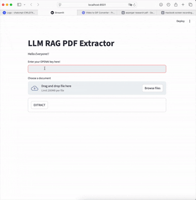
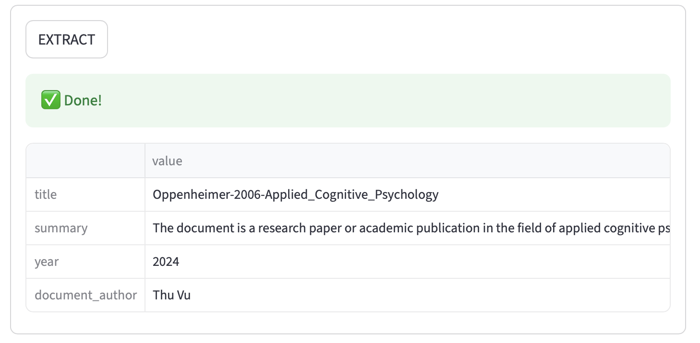
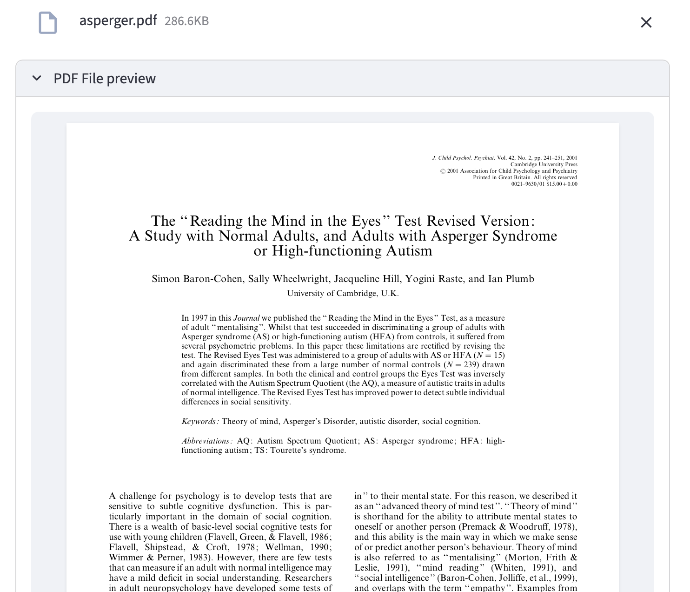

# 🧠 LLM RAG PDF Extractor

A **Streamlit-based Retrieval-Augmented Generation (RAG)** app that extracts and summarizes structured (can be redefined) information (title, author, year, and summary) from a PDF document using **OpenAI GPT models** and **LangChain**.

---

## 🚀 Features

- Upload and preview PDF files directly in the browser  
- Automatically chunk, embed, and index document text using **ChromaDB**  
- Query and extract structured metadata (title, author, summary, year)  
- Powered by **GPT-4o**, **LangChain**, and **Streamlit**  
- Clean UI and interactive workflow  

---

Check out this demo:





## 🧩 Project Structure
- app/
  - streamlit_app.py      # Main Streamlit app
  - functions.py          # Core logic and RAG pipeline
  - requirements.txt      # Python dependencies
- README.md

---

## 📦 Installation

### 1. Clone the repository###
```
git clone https://github.com/<your-username>/llm-rag-pdf-extractor.git
cd llm-rag-pdf-extractor

2. Create and activate a virtual environment

python3 -m venv venv
source venv/bin/activate   # macOS/Linux
venv\Scripts\activate      # Windows

3. Install dependencies
pip install -r requirements.txt

Or install manually:

pip install streamlit pandas langchain langchain-community langchain-openai \
             chromadb langchain_experimental pypdf python-dotenv tabulate
```
---
## 📦 Installation
###🔑 Environment Setup
You’ll need an OpenAI API key to run this app.
You can either:
Enter it directly in the app when prompted, or
Set it in your terminal before running:

```
export OPENAI_API_KEY="your_api_key_here"   # macOS/Linux
setx OPENAI_API_KEY "your_api_key_here"    # Windows
```

## ▶️ Run the App

```
streamlit run app/streamlit_app.py
```

Open the URL displayed in the terminal (e.g., http://localhost:8501) to use the app.

## 💡 How It Works
Upload a PDF file — The app reads and decodes the text content.
Embeddings — Text chunks are embedded using OpenAI’s text-embedding-3-small.
Vectorstore — Embeddings are stored and indexed in a local ChromaDB database.
RAG pipeline — The app uses GPT-4o to extract structured metadata (title, summary, author, year) from relevant chunks.
Output — Results are displayed in a formatted Pandas DataFrame.

## 🧠 Key Components
Function    Purpose
connect_chat_openai()    Connects to OpenAI’s GPT model
get_embedding_function()    Creates embedding model instance
load_vectorstore()    Splits and embeds text into ChromaDB
prompt()    Constructs RAG pipeline and returns structured LLM output
ExtractInfo    Pydantic model defining the structured response schema

### 🧾 Example Output
title    summary    year    document_author
"AI and the Future of Work"    Overview of AI’s economic impact    2024    John Doe

### ⚠️ Troubleshooting
Error: Missing API key → Check your OpenAI key entry or environment variable.
PDF not processed → Ensure the file is valid text-based PDF (not scanned images).
Slow response → GPT and embedding calls may take several seconds per document.
## 📚 Acknowledgements
LangChain
Streamlit
ChromaDB
OpenAI GPT models

## 🧑‍💻 Author
Shirley Li
Software Engineer
